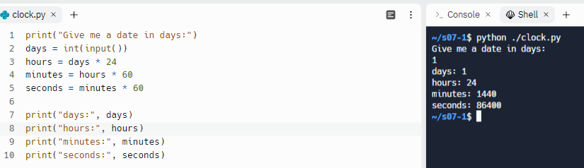
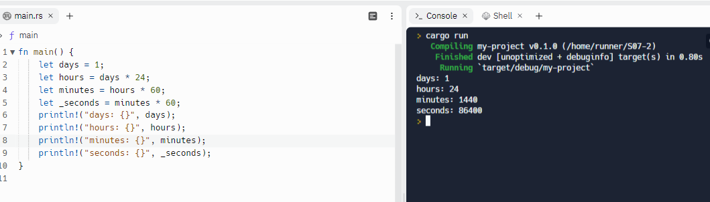

# Task S07

- Elaborar un programa que permita convertir\* Días a horas, horas a minutos y minutos a segundos
- Elegir al menos 2 lenguajes de programación (indagar algunos detalles técnicos de dichos lenguajes)

---

# Python



```python
print("Give me a date in days:")
days = int(input())
hours = days * 24
minutes = hours * 60
seconds = minutes * 60

print("days:", days)
print("hours:", hours)
print("minutes:", minutes)
print("seconds:", seconds)
```

---

# Rust



```rust
fn main() {
    let days = 1;
    let hours = days * 24;
    let minutes = hours * 60;
    let _seconds = minutes * 60;
    println!("days: {}", days);
    println!("hours: {}", hours);
    println!("minutes: {}", minutes);
    println!("seconds: {}", _seconds);
}
```
